# Gloves off: Boxing Quiz
(Developer: Jason Foster)

[Live webpage](https://jason-fos.github.io/gloves-off-boxing-quiz/)

## Table of Content

1. [Project Goals](#project-goals)
    1. [User Goals](#user-goals)
    2. [Site Owner Goals](#site-owner-goals)
2. [User Experience](#user-experience)
    1. [Target Audience](#target-audience)
    2. [User Requirements and Expectations](#user-requirements-and-expectations)
    3. [User Stories](#user-stories)
3. [Design](#design)
    1. [Design Choices](#design-choices)
    2. [Colour](#colours)
    3. [Fonts](#fonts)
    4. [Structure](#structure)
    5. [Wireframes](#wireframes)
4. [Technologies Used](#technologies-used)
    1. [Languages](#languages)
    2. [Frameworks & Tools](#frameworks-&-tools)
5. [Features](#features)
6. [Testing](#validation)
    1. [HTML Validation](#HTML-validation)
    2. [CSS Validation](#CSS-validation)
    3. [Accessibility](#accessibility)
    4. [Performance](#performance)
    5. [Device testing](#performing-tests-on-various-devices)
    6. [Browser compatibility](#browser-compatability)
    7. [Testing user stories](#testing-user-stories)
8. [Bugs](#Bugs)
9. [Deployment](#deployment)
10. [Credits](#credits)
11. [Acknowledgements](#acknowledgements)

## Project Goals 

### User Goals
- Play a challenging and entertaining quiz game.
- Learn some new facts about boxing.
- Get a final score on completion.
- Have fun.

### Site Owner Goals
- Increase the number of users it has.
- An easy to navigate and read site for users.
- Provide users with relative information about the site.
- Clearly displayed game area with questions and answers.

## User Experience

### Target Audience
- Anyone looking to take part in an online quiz game.
- Boxing fans.

### User Requirements and Expectations

- A simple and easy to use navigation system.
- Quickly and easily find relevant information.
- Links and functions should work as expected.
- A well presented and visually appealing design regardless of screen size.
- Clearly dispalyed and easily read questions and answers.
- Simple content that doesnt overwhelm the user.
- Accessibility and performance.

### User Stories

#### Site User 
1. As a site user, I want to be able to find the quiz page easily.
2. As a site user, I want to be able to find and read the rules easily.
3. As a site user, I want to know if my answer was correct or not.
4. As a site user, I want to be able see my score.
5. As a site user, I want to be able to create a username.
6. As a site user, I want to know my progress during the quiz.

#### Site Owner 
7. As the site owner, I want users to be able to navigate the site with ease.
8. As the site owner, I want to display relevant information clearly to the user.
9. As the site owner, I dont want the user to use the browser back arrow when no page is found.
10. As the site owner, I want users to be displayed with a game over or win message on quiz completion.

## Design

### Design Choices

The webpage was designed to be eye catching, easy to navigate and clearly display relevant information.

### Colour
For the colour scheme bold colours were chosen to catch users attention. The red and blue was chosen as it represents the red and blue corners of a boxing ring. 
 

### Fonts

Lato was used for the headings as i think it looks good in a larger font size and it is easy to read. 
 
Oswald was used for text as it compliments the headings nicely and is easily readable on screen, both have back up font of sans-serif as its also easily readable on screen.

### Structure
The page is structured in a recognizable, user friendly and easy to learn way. on arriving to the site the user sees a logo with a navigation bar, with the links spaced out under the logo that highlight on mouse over.
The website consists of 3 separate pages: 
- A homepage with the logo and navigation links, a rules and scoring explained section and boxing related images.
- A quiz page which is has a create username area aswel as the main game area where the quiz questions, answers and results are displayed
- A custom 404 page for any page not found errors.

### Wireframes

Home Page

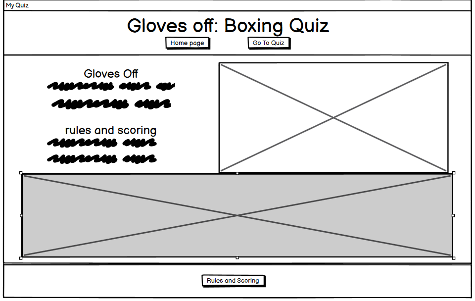
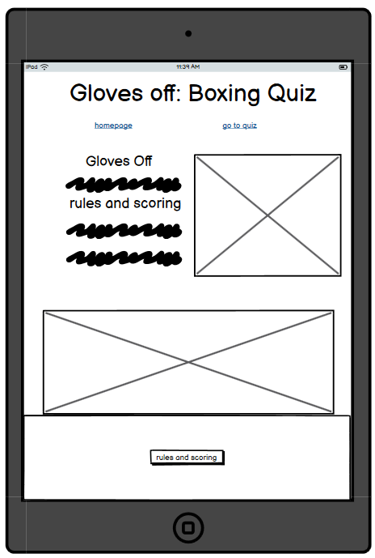
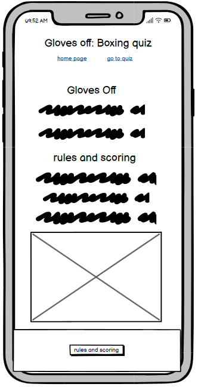

Quiz Page

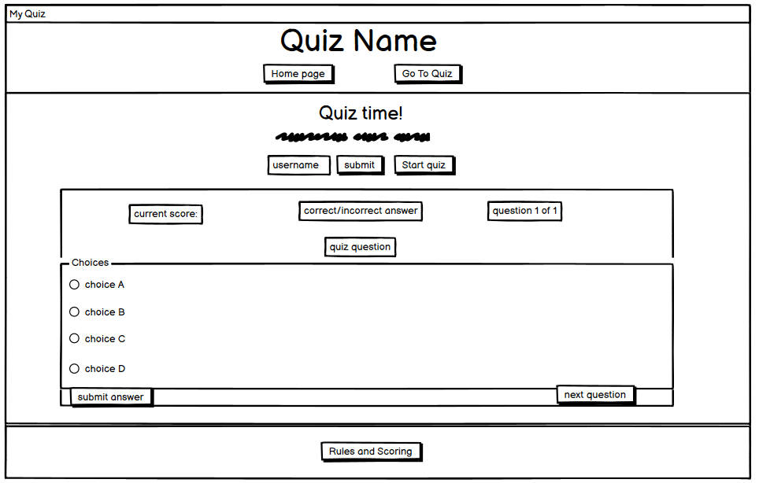
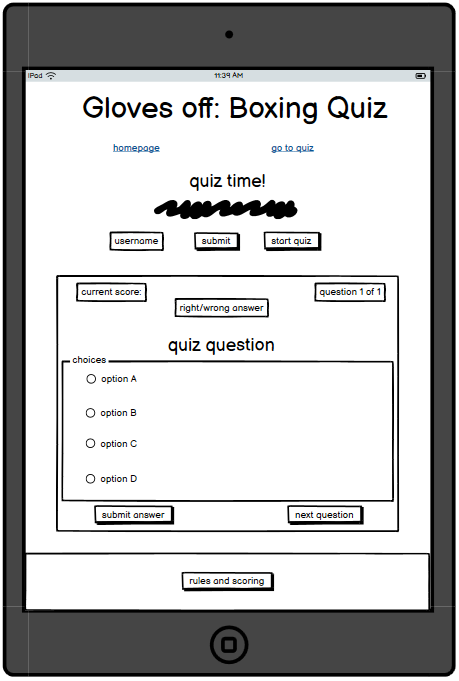
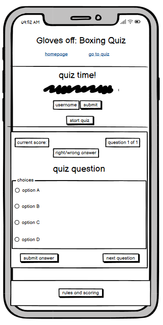

404 Error Page

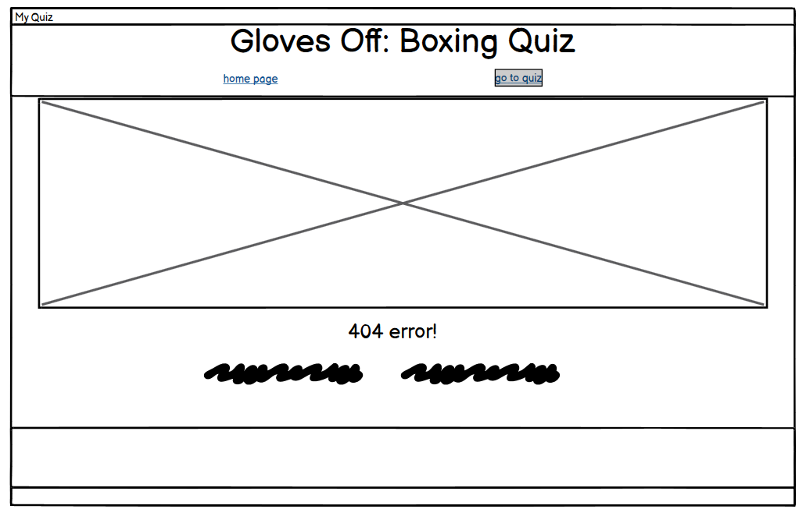
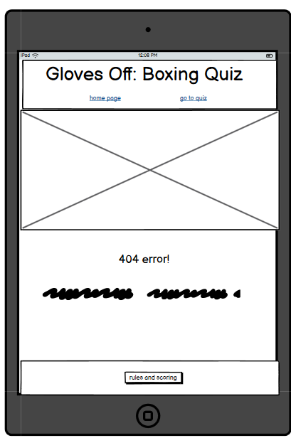
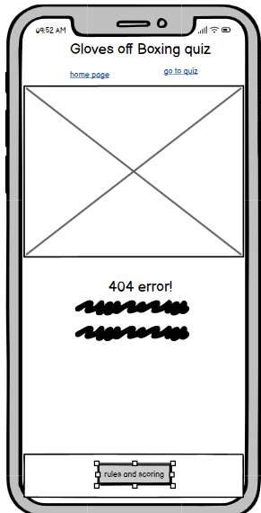

## Technologies Used

### Languages
- HTML
- CSS
- Javascript

### Frameworks & Tools
- Git
- GitHub
- Gitpod
- Balsamiq
- Google Fonts
- Adobe Color
- Favicon.io
- Python tutor
- Chrome Devtools

## Features
The page consists of 3 pages and 9 features.

### Logo and Navigation Bar
- Featured on all 3 pages
- The navbar is responsive and changes to suit the users screen.
- It includes links to the Homepage and the Quiz page.
- It allows users to easily navigate around the page.
- The links highlight green on mouseover so user knows its interactive. 
- User stories covered: 1, 7

### Rules and Scoring section
- Gives a brief description of the quiz.
- Allows the user to read the rules and see how the quiz is scored.
- User stories covered: 2, 8

### Rules and scoring toggle button
- Allows users to recap the rules and scoring by clicking the button in the footer.
- The div with rules and scoring in  is hidden by default.
- When clicked the div with the rules and scoring in is made visible. 
- User stories covered: 2, 8

### Create Username
- Allows the user to create a username for the quiz.
- Allows the quiz to display a win or lose message to the user using their username.
- User stories covered: 5, 10 

### Right Or Wrong Answer Message To User
- Displays to the user whether the question they just answered was right or wrong.
- User stories covered: 3, 8

### Current Score
- Current score increments up and down by 10pts depending on correct or incorrect answers from the user.
- Allows user to keep track of their score throughout the quiz.
- If score goes below 0 game over message is displayed to the user.
- User stories covered: 4, 8

### Quiz Question Progress
- The progress of the quiz is displayed to the user by displaying what question they are on and how many there are.
- User stories covered: 6, 8

### Game Over Or Win Display
- Provides the user with a game over message using the submitted username.
-  Provides the user with a win message showing their username and final score.
- User stories covered: 4, 10

### 404 error page
- Allows the user to navigate back to home page without using browser back arrow.
- User stories covered: 9

## Validation

### HTML Validation
The W3C Markup Validation Service was used to validate the HTML of the website. index.html had 2 errors, 1 spelling error and 1 stray div closing tag. 

Home Page

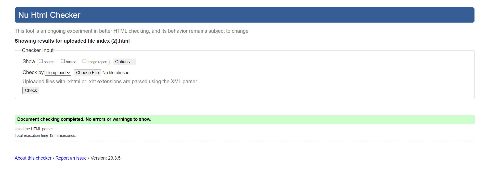

Quiz Page

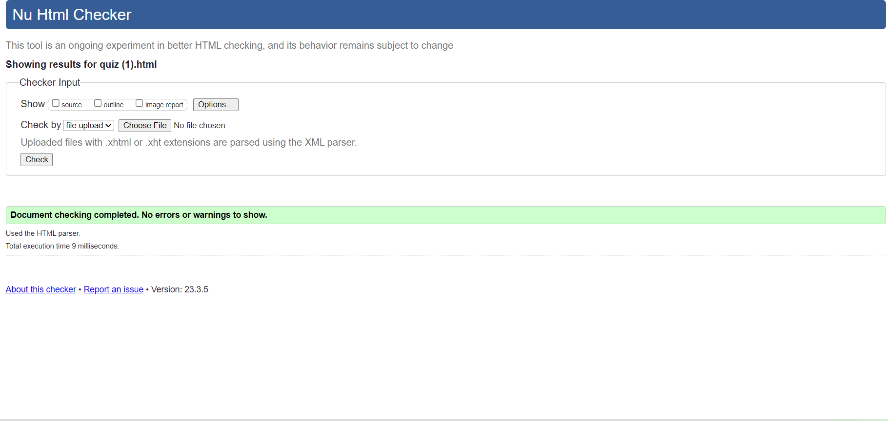

404 Page

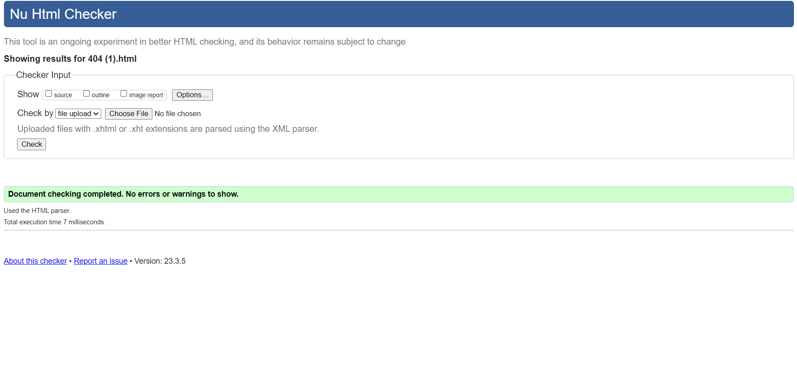

### CSS Validation
The W3C Jigsaw CSS Validation Service was used to validate the CSS of the website.

CSS File (style.css)

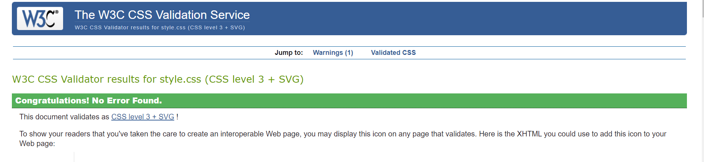

### Javascript
The javascript files were checked using jshint, it shows no errors or undefined variables.

script.js, questions.js

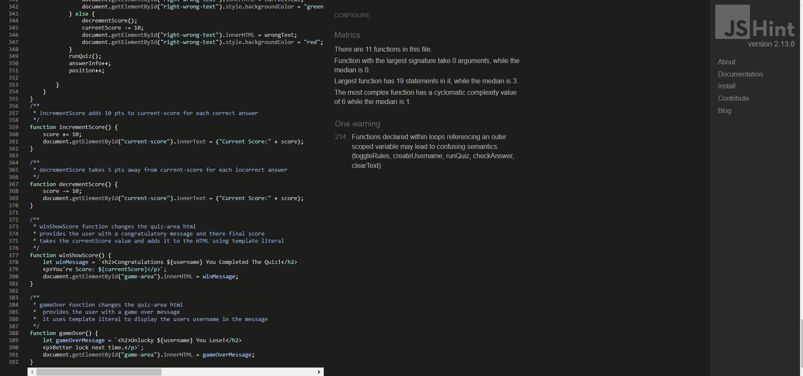

### Accessibility
The WAVE WebAIM web accessibility evaluation tool was used to ensure the website met high accessibility standards. All pages pass with no errors.

Home Page

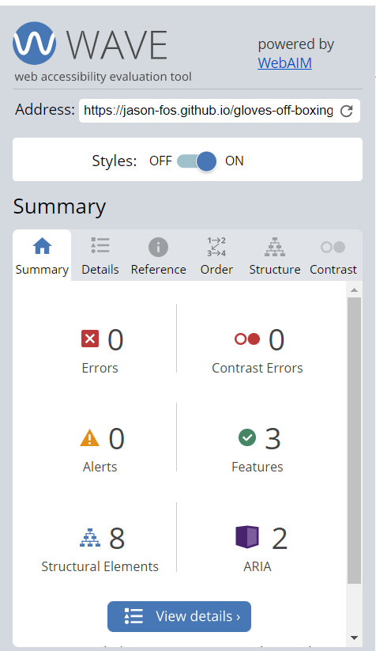

Quiz Page

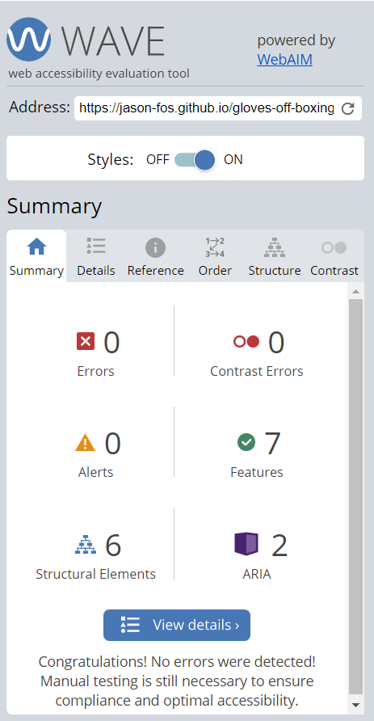

404 Page

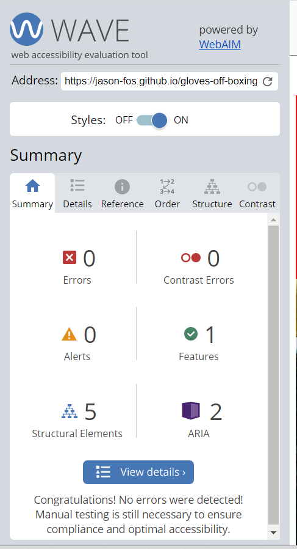

### Performance 
Google Lighthouse in Google Chrome Developer Tools was used to test the performance of the website. 

Home Page

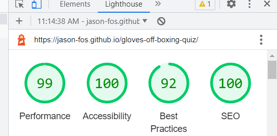

Quiz Page

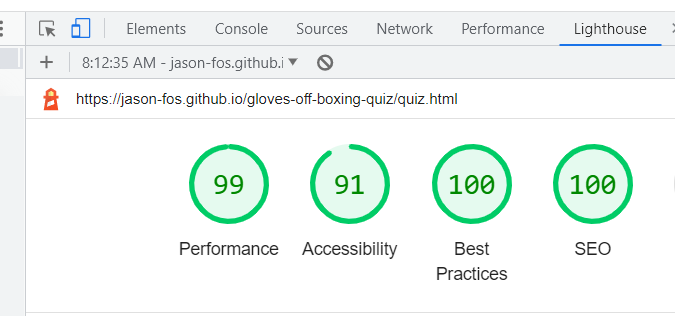

### Performing tests on various devices 
The website was tested on the following devices:
- Samsung A5
- Samsung A22
- Acer Aspire 3

In addition, the website was tested using Google Chrome Developer Tools Device Toggeling option for all available device options.

### Browser compatability
The website was tested on the following browsers:
- Google Chrome
- Microsoft Egde

### Testing user stories
1. As a site user, I want to find the quiz page easily.

| **Feature** | **Action** | **Expected Result** | **Actual Result** |
|-------------|------------|---------------------|-------------------|
| Navigation link | Click the Go To Quiz link from the navigation menu | Take user to the quiz page | Works as expected |

Screenshots

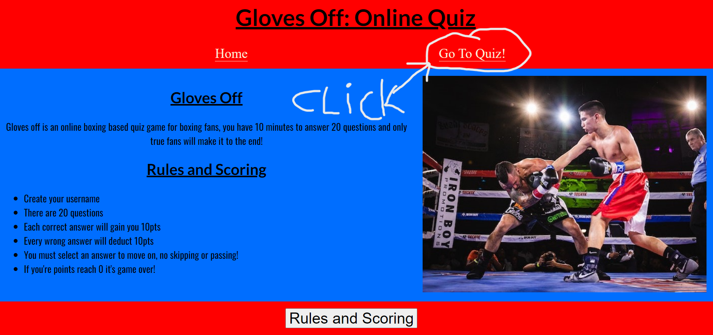
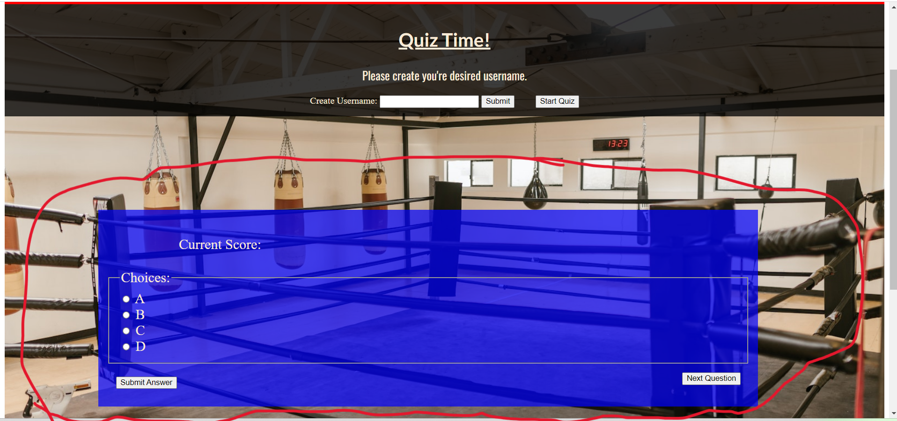

2. As a site user, I want to be able to find and read the rules easily.

| **Feature** | **Action** | **Expected Result** | **Actual Result** |
|-------------|------------|---------------------|-------------------|
| Rules and Scoring section | Clearly displayed on the home page | Provide information on the rules and scoring | Works as expected |
| Toggle rules button in footer | Click rules button in footer | Toggle the rules from hidden to visible | Works as expected |

Screenshots

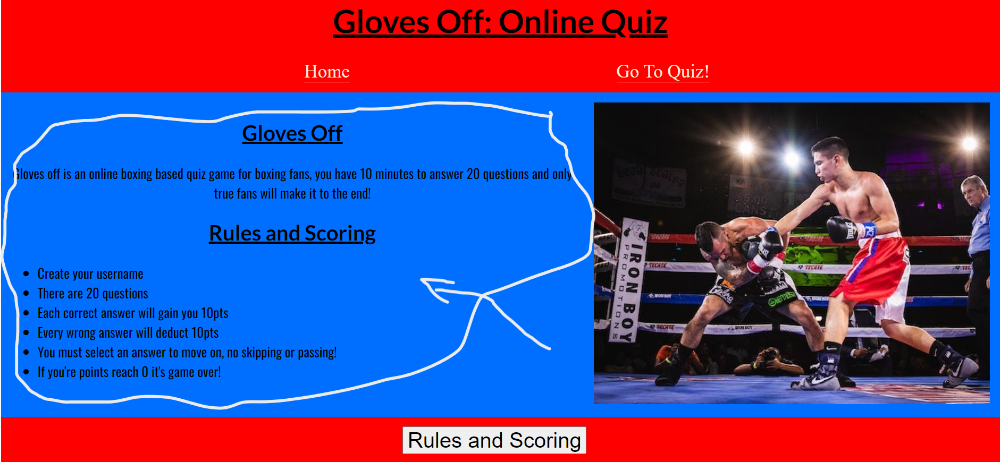
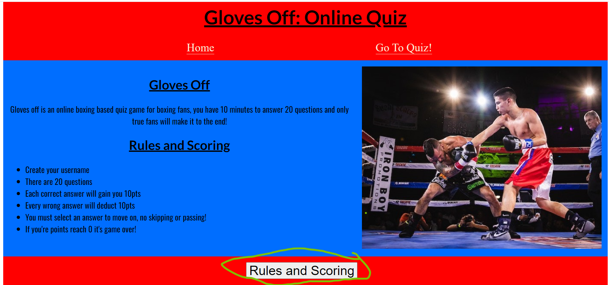
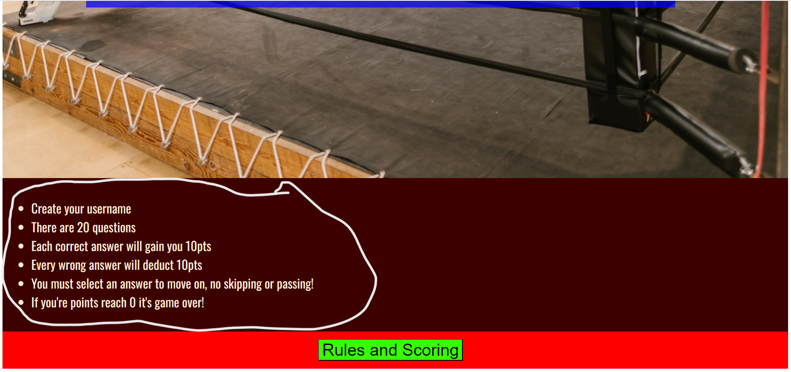

3.  As a site user, I want to know if my answer was correct or not.

| **Feature** | **Action** | **Expected Result** | **Actual Result** |
|-------------|------------|---------------------|-------------------|
| right/wrong message| click submit answer button in the quiz | Display right or wrong answer message to user | Works as expected |

Screenshots

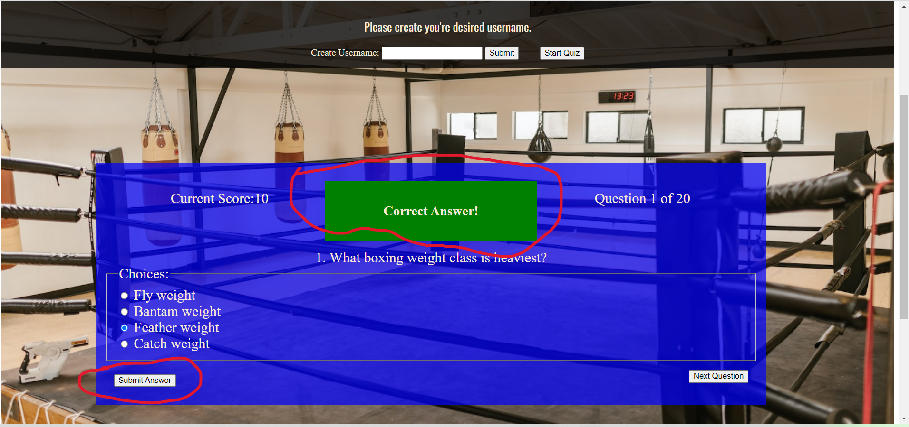

4. As a site user, I want to be able see my score.

| **Feature** | **Action** | **Expected Result** | **Actual Result** |
|-------------|------------|---------------------|-------------------|
| Current Score | Top left corner of the quiz area provides a score | Display the score to the user | Works as expected |

Screenshots

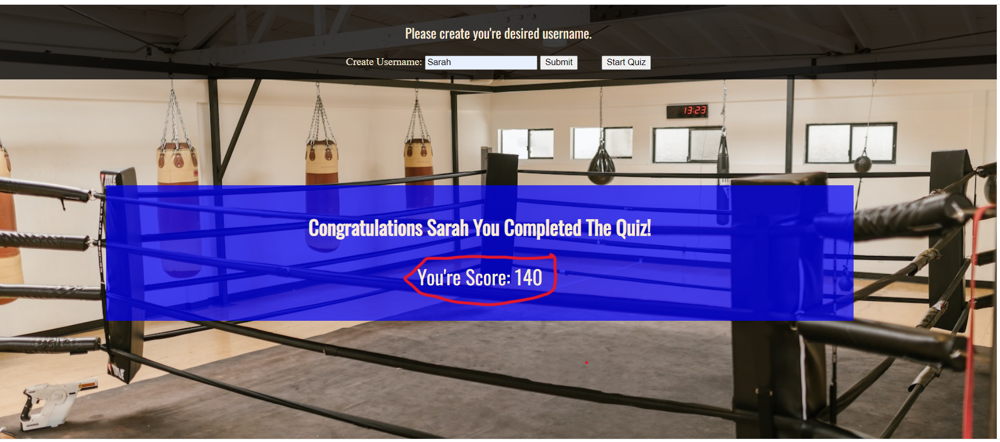

5.As a site user, I want to be able to create a username.
| **Feature** | **Action** | **Expected Result** | **Actual Result** |
|-------------|------------|---------------------|-------------------|
| Create username | Click go to quiz in nav menu, enter username where prompted and click submit | Create a username | Works as expected |

Screenshots

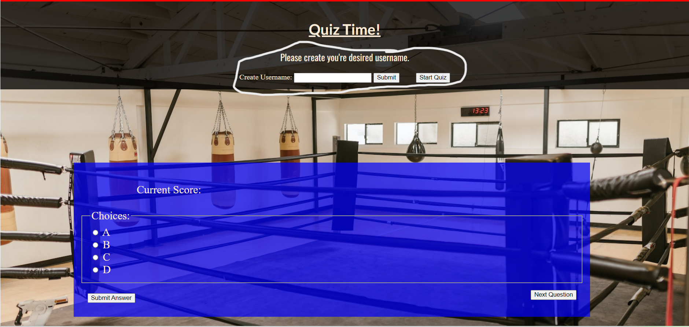

6. As a site user, I want to know my progress during the quiz.

| **Feature** | **Action** | **Expected Result** | **Actual Result** |
|-------------|------------|---------------------|-------------------|
| Quiz progress | Top right corner of quiz area displays quiz progress | To display the quiz progress to the user | Works as expected |

Screenshots

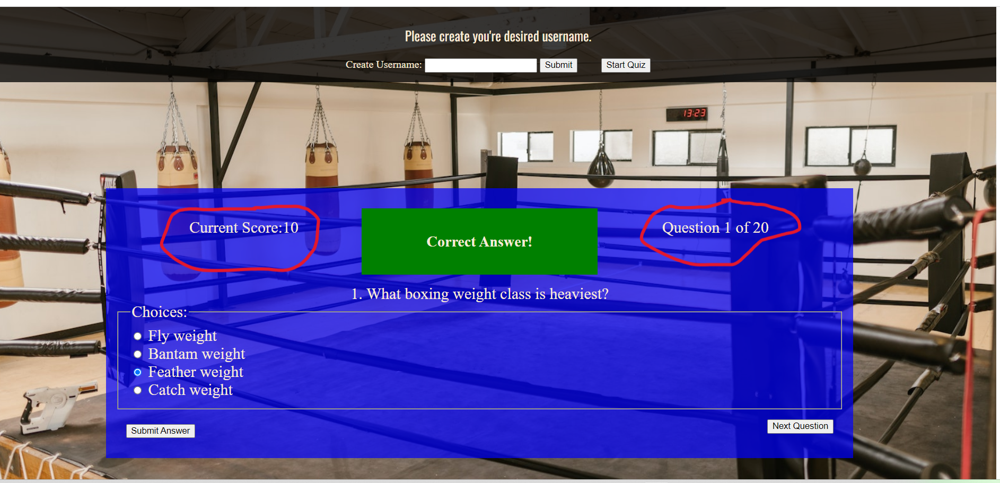

7.As the site owner, I want users to be able to navigate the site with ease.

| **Feature** | **Action** | **Expected Result** | **Actual Result** |
|-------------|------------|---------------------|-------------------|
| Navigation bar | Click links in nav menu | Navigate around the site | Works as expected |

Screenshots

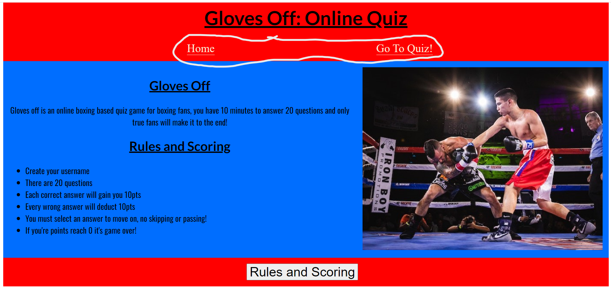

8. As the site owner, I want to display relevant information clearly to the 
   user.

| **Feature** | **Action** | **Expected Result** | **Actual Result** |
|-------------|------------|---------------------|-------------------|
| Rules and scoring section | Clearly displayed on home page | Clearly display information to the user | Works as expected |
| Quiz area | go to quiz page and start quiz | Clearly display information to the user | Works as expected |

Screenshots

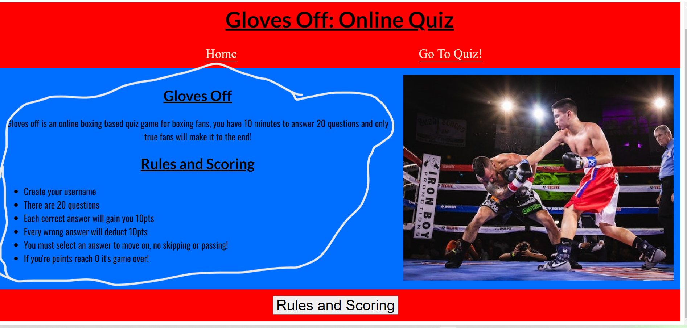
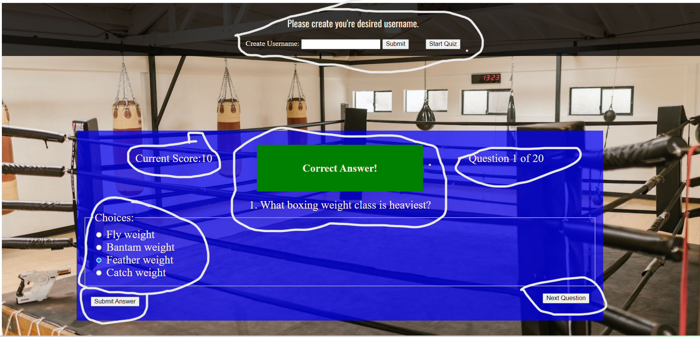

9. As the site owner, I want users to be displayed with a game over or win message on quiz completion.

| **Feature** | **Action** | **Expected Result** | **Actual Result** |
|-------------|------------|---------------------|-------------------|
| Game over/Win message | Lose or complete the quiz | Display game over or win message to user | Works as expected |

Screenshots

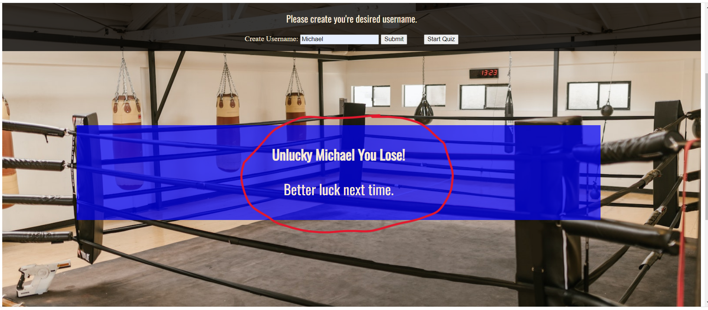
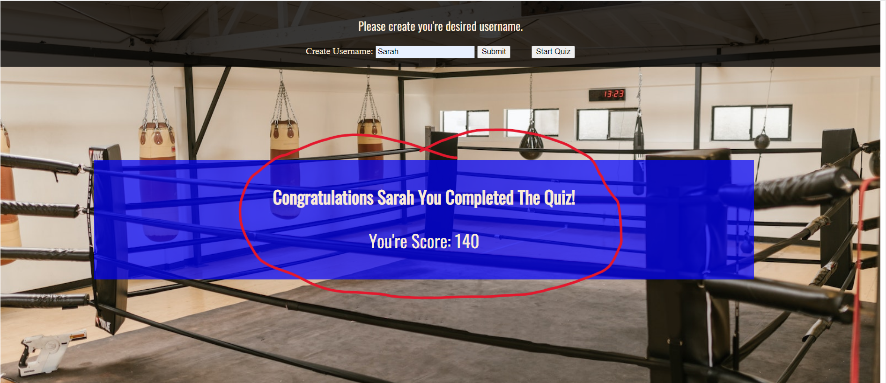

10. As the site owner, I dont want the user to use the browser back arrow when 
   no page is found.

| **Feature** | **Action** | **Expected Result** | **Actual Result** |
|-------------|------------|---------------------|-------------------|
| 404 page | Click any link in navigation bar to return to site | Prevent user from using browser back arrows | Works as expected |

Screenshots

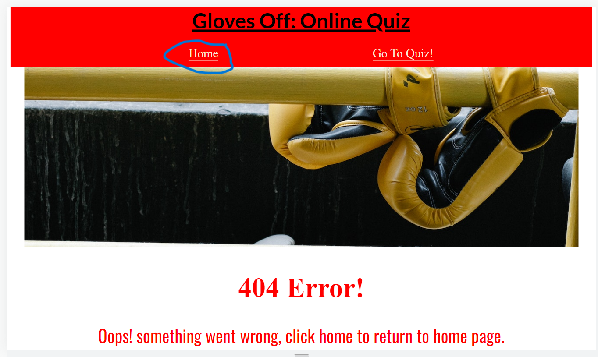

## Bugs

| **Bug** | **Fix** |
| ----------- | ----------- |
| None of the images load on page | Change all file paths to absolute |
| Home page image too big causing performance issues | Reduce size of images | 
| Text in quiz area overflowing on small screens | write media query to reduce font size on smaller screens |

## Deployment
The website was deployed using GitHub Pages by following these steps:
1. In the GitHub repository navigate to the Settings tab.
2. On the left hand menu select Pages.
3. For the source select Branch: master.
4. After the webpage refreshes automaticaly you will see a ribbon on the top saying: "Your site is published at (https://jason-fos.github.io/gloves-off-boxing-quiz/)

You can fork the repository by following these steps:
1. Go to the GitHub repository.
2. Click on Fork button in upper right hand corner.

You can clone the repository by following these steps:
1. Go to the GitHub repository. 
2. Find the Code button above the list of files and click it. 
3. Select which you prefer, clone using HTTPS, SSH, or Github CLI and click the copy button to copy the URL.
4. Open Git Bash.
5. Change the current working directory to the one where you want the cloned directory.
6. Type git clone and paste the copied URL.
7. Press Enter to create your local clone.

## Credits

### Media
- All images were taken from pexels.com.
- W3CSchools.com was used for better understanding of compatability of form elements and responsive grid design.
- Questions for the quiz came from (https://www.radiotimes.com/ 
  quizzes/pub-quiz-boxing).
  
### Code
- 404 page was built using description on [GitHub Docs](https://docs.github.com/en/pages/getting-started-with-github-pages/creating-a-custom-404-page-for-your-github-pages-site).
- W3CSchools.com was used for better understanding of compatability of form elements and responsive grid design.

## Acknowledgements
I would like to take the opportunity to thank:
- My mentor Mo Shami for his advice, guidance and support.
- My partner and friends for helping with testing and giving valuable feedback.
- Code institute as a whole for the support they provide.